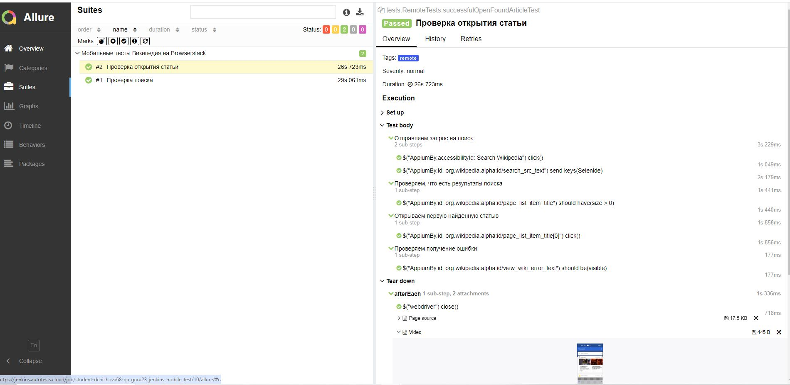
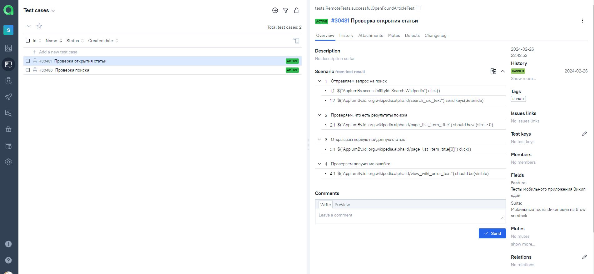
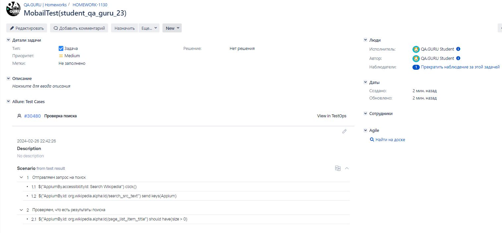
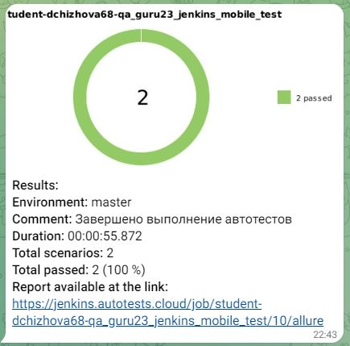

# Проект по автоматизации тестирования мобильного приложения [Wikipedia](https://github.com/wikimedia/apps-android-wikipedia/)
<p align="center">

</p>

## :scroll: Содержание:
* <a href="#tools">Используемый стек</a>
* <a href="#cases">Примеры автоматизированных тест-кейсов</a>
* <a href="#console">Запуск из терминала</a>
* <a href="#jenkins">Запуск тестов в Jenkins</a>
* <a href="#allure">Allure отчет</a>
* <a href="#allure-testops">Интеграция с Allure TestOps</a>
* <a href="#jira">Интеграция с Jira</a>
* <a href="#telegram">Уведомление в Telegram при помощи бота</a>
* <a href="#video">Примеры видео выполнения тестов на BrowserStack</a>


<a id="tools"></a>
## :computer:<a name="Используемый стек">**Используемый стек:**</a>

<p align="center">
<a href="https://www.java.com/"></a>
<a href="https://selenide.org/"></a>
<a href="https://gradle.org/"></a>
<a href="https://junit.org/junit5/"></a>
<a href="https://github.com/"></a>
<a href="https://aerokube.com/selenoid/"></a>
<a href="https://github.com/allure-framework/allure2"></a>
<a href="https://qameta.io/"></a>
<a href="https://www.jenkins.io/"></a>
<a href="https://web.telegram.org/a/"></a>
<a href="https://www.atlassian.com/ru/software/jira/"></a>
<a href="https://appium.io/docs/en/2.4/"></a>
<a href="https://www.browserstack.com/"></a>
  
</p>


<a id="cases"></a>
## <a name="Примеры автоматизированных тест-кейсов для запуска на локальном эмуляторе">**Примеры автоматизированных тест-кейсов для запуска на локальном эмуляторе:**</a>

- ✓ *Проверка поиска*
- ✓ *Проверка открытия статьи*
- ✓ *Проверка описание статьи*

- ## <a name="Примеры автоматизированных тест-кейсов для запуска на BrowserStack">**Примеры автоматизированных тест-кейсов для запуска на BrowserStack:**</a>

- ✓ *Проверка поиска*
- ✓ *Проверка открытия статьи*


<a id="console"></a>
## :keyboard: Запуск автотестов

***Локальный запуск тестов:***

Из корневой директории проекта выполнить:
```
gradle clean remote_test -DdeviceHost=remote  - запуск тестов на BrowserStack
gradle clean local_test -DdeviceHost=local    - запуск тестов на локальном эмуляторе

```
<a id="jenkins"></a>
## </a><a name="Сборка"></a>Удаленный запуск тестов в [Jenkins](https://jenkins.autotests.cloud/job/student-dchizhova68-qa_guru23_jenkins_mobile_test/)</a>

Для запуска сборки необходимо нажать кнопку <code>Build Now</code>.

<a id="allure"></a>
##  </a> Пример  [Allure-отчета](https://jenkins.autotests.cloud/job/student-dchizhova68-qa_guru23_jenkins_mobile_test/10/allure/) </a>  
Дождаться выполнения сборки. нажать на кнопку "Allure Report"


Пример Allure Report: 


<a id="allure-testops"></a>
##  </a> Интеграция с [Allure TestOps](https://allure.autotests.cloud/project/4084/test-cases) </a> 

Реализована интеграция с <code>Allure TestOps</code>. Есть возможность просмотре результата выполнения автотестов и создания ручных тестов. 

<p align="center">

</p>


<a id="jira"></a>
##  </a> Интеграция с [Jira](https://jira.autotests.cloud/browse/HOMEWORK-1130) </a> 

Реализована интеграция <code>Allure TestOps</code> с <code>Jira</code>, в задаче отображаются связные автотесты и результат их выполнения.

<p align="center">

</p>


<a id="telegram"></a>
##  Уведомления в Telegram с использованием бота

Результаты выполнения автотестов отправляются в Telegram.

<p align="center">

</p>


<a id="video"></a>
##  Видео примера запуска тестов на BrowserStack

В отчетах Allure для каждого теста прикреплено видео прохождения теста 
<p align="center">
  
</p>
